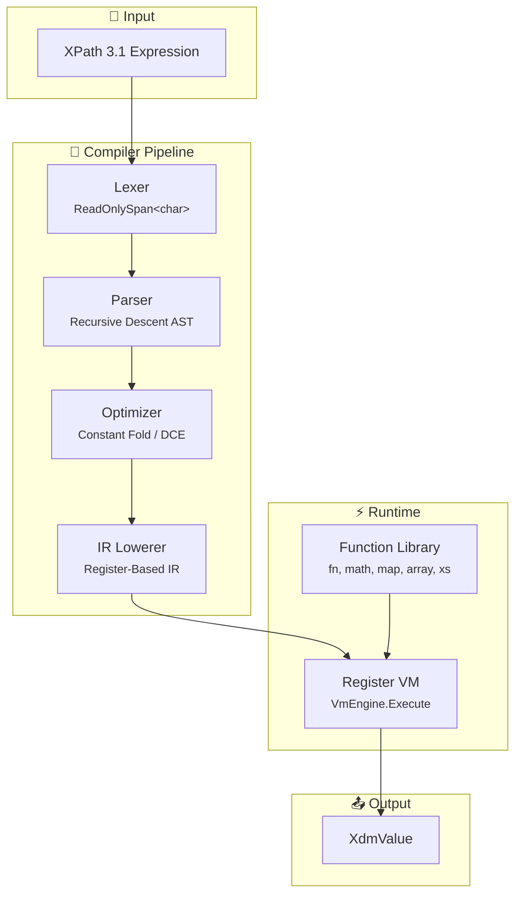

<div align="center">
  
  <br><br>
  <h1 style="color:#2F4F4F; font-family:Poppins,Segoe UI,sans-serif; margin:0;">Bosak XPath</h1>
  <p style="color:#556B2F; font-family:Poppins,Segoe UI,sans-serif; font-size:1.1rem; margin:0.5rem 0 0;">
    A high-performance, XDM-first XPath 3.1 + XSLT 3.0 engine for .NET, with XQuery 3.1 planned
  </p>
</div>

<br>

<div align="center">

[](https://dotnet.microsoft.com/)
[](LICENSE.md)
[]()

</div>

---

## Overview

**Bosak** is a ground-up .NET implementation of **XPath 3.1** (with forward-compatibility for 4.0), designed as the expression-engine foundation for future XQuery and XSLT processors.

Unlike `System.Xml.XPath`, Bosak is built on the **W3C XQuery Data Model (XDM)** from day one. Expressions are compiled once to an intermediate representation (IR) and executed many times on a lightweight, register-based virtual machine.

### Key Features

- **XDM-First Architecture** — All inputs are adapted to `IXdmNode`; no proprietary DOM lock-in
- **Compile Once, Execute Many** — Parse → Optimize → Lower to IR → VM execution
- **Zero-Allocation Sequences** — Lazy struct enumerators avoid `IEnumerable<T>` boxing on hot paths
- **Pluggable Backends** — Works with `XDocument`, `XmlDocument`, streaming readers, or custom `IXdmNode` providers
- **XPath 3.1 Complete** — Maps, arrays, higher-order functions, arrow expressions (`=>`), string concat (`||`), FLWOR, JSON functions
- **XSD Regex with Pinned Unicode 9.0** — Full `\p{X}`/`\P{X}` category and `\p{IsBlock}` support, class subtraction, astral-safe matching
- **XSLT 3.0 Transform Engine** — Template matching, sequence constructors, `xsl:copy`/`xsl:copy-of`, `xsl:for-each-group`, `xsl:analyze-string`, `xsl:where-populated`, `xsl:on-empty`, `xsl:iterate`/`xsl:break`, `fn:transform()`

---

## Quick Start

```csharp
using Bosak.XPath.Api;
using Bosak.XPath.Core.Xdm;

// Compile once
var expr = XPath31Expression.Compile("$price * (1 + $taxRate)");

// Execute many times with different inputs
var ctx = new EvaluationContext()
    .WithVariable("price", XdmValue.FromDecimal(100.00m))
    .WithVariable("taxRate", XdmValue.FromDecimal(0.21m));

var result = expr.Evaluate(ctx);
Console.WriteLine(result.DecimalValue); // 121.00
```

### Conditional Expressions

```csharp
var expr = XPath31Expression.Compile(
    "if ($score ge 90) then 'A' else if ($score ge 80) then 'B' else 'C'");
```

### Sequence & Range

```csharp
var expr = XPath31Expression.Compile("1 to 5");
// Returns: [1, 2, 3, 4, 5]
```

---

## Architecture



### Layer Stack

| Layer | Project | Responsibility |
|-------|---------|----------------|
| **Public API** | `Bosak.XPath.Api` | `XPath31Expression`, `CompileOptions`, `EvaluationContext` |
| **Standard Library** | `Bosak.XPath.Standard` | `fn:*`, `math:*`, `map:*`, `array:*`, `xs:*` constructors |
| **Runtime / VM** | `Bosak.XPath.Runtime` | `VmEngine`, function dispatch, sequence operators |
| **Compiler / IR** | `Bosak.XPath.Compiler` | `XPathOptimizer`, `IrLowerer`, bytecode emitter |
| **Parser** | `Bosak.XPath.Parser` | `XPathLexer`, `XPathParser`, AST nodes |
| **XDM Core** | `Bosak.XPath.Core` | `XdmValue`, `IXdmNode`, `XdmSequence`, axis kinds |
| **Node Providers** | `Bosak.XPath.Providers` | `XDocument`, `XmlDocument`, streaming adapters *(planned)* |
| **XSLT** | `Bosak.Xslt` | `XsltCompiler`, `TransformEngine`, `fn:transform()` |
| **XQuery** | `Bosak.XQuery` | `XQueryCompiler`, FLWOR engine *(skeleton)* |
| **Language Server** | `Bosak.LanguageServer` | LSP server for XPath / XSLT diagnostics & completions |
| **VS Code Extension** | `vscode-bosak/` | TypeScript client for the language server |

---

## Performance Strategy

| Technique | Application |
|-----------|-------------|
| `ReadOnlySpan<char>` | Lexer, string comparisons, name tests |
| Struct enumerators | `XdmSequence`, axis iteration |
| `ArrayPool<T>` | Temporary buffers during sorting / materialization |
| Lazy evaluation | Sequences, predicates, path steps |
| Register VM | Expression execution (better cache locality than tree walking) |
| IL JIT *(future)* | Hot expression compilation to `DynamicMethod` |

---

## Roadmap

| Phase | Deliverable | Status |
|-------|-------------|--------|
| 1 | XPath 3.1 Core — compiler + VM + standard functions | ✅ Complete |
| 2 | XSLT 2.0/3.0 — template matching, sequence constructors, `fn:transform()` | ✅ Complete — full option surface + QT3 Tier-2m (117/124 passed, 7 skipped) |
| 3 | XQuery 3.1 — FLWOR prolog, query context | 🚧 Skeleton |
| 4 | Streaming — `XmlReader`-backed `IXdmNode` | 📋 Planned |
| 5 | Database backends — XML database adapters | 📋 Planned |

---

## VS Code Extension

A Language Server Protocol (LSP) implementation and VS Code extension provide IDE features for XPath and XSLT development.

### Quick Install

```bash
# 1. Build the language server
dotnet build src/Bosak.LanguageServer/Bosak.LanguageServer.csproj

# 2. Build the extension
cd vscode-bosak
npm install
npm run compile

# 3. Open in VS Code and press F5 to launch the Extension Development Host
```

See [`vscode-bosak/README.md`](./vscode-bosak/README.md) for full installation options (VSIX, custom server path, troubleshooting).

---

## Building

```bash
dotnet build Bosak.sln
dotnet test Bosak.sln
```

Target framework: **.NET 10**.

All 1,343 unit tests pass (0 failures).

---

## Conformance Testing

Bosak includes a W3C QT3 test suite harness for measuring XPath 3.1 standards compliance.

### Running the Harness

```bash
# Build the conformance runner
dotnet build tests/Bosak.XPath.Conformance/Bosak.XPath.Conformance.csproj

# Run against the full QT3 suite (~32,000 tests across 428 test sets)
dotnet run --project tests/Bosak.XPath.Conformance/Bosak.XPath.Conformance.csproj
```

The harness:
1. Discovers all test sets from `tests/qt3tests/catalog.xml`
2. Filters out unsupported features (schema-aware, XQuery-only, serialization, static typing)
3. Skips XQuery syntax (`declare`, `import`, semicolons)
4. Executes each test via the public `XPath31Expression.Compile(expr).Evaluate(ctx)` API
5. Compares results against QT3 assertions (`assert-eq`, `assert-true`, `assert-xml`, etc.)

### Current Results

| Metric | Value |
|--------|-------|
| **XPath (QT3)** | 428 test sets, ~32,000 tests |
| Pass Rate (XPath) | **67.93%** (21,618 passed / 319 failed / 9,884 skipped); **98.54%** of runnable tests pass |
| **XSLT 3.0** | 234 test sets, 14,600 tests |
| Pass Rate (XSLT) | **7,109 passed / 0 failed / 7,491 skipped** — 100% of runnable tests pass |
| unicode-90 set | **1,365 passed / 0 failed / 95 skipped** (skips are upstream test/data defects) |
| Unsupported Features | Schema awareness, XQuery-only, XML 1.1, streaming, principal `xsl:package`/`xsl:use-package` |

### Known Limitations

| Assertion | Status | Impact |
|-----------|--------|--------|
| `assert-eq` | ✅ Implemented | Core value comparison |
| `assert-count` | ✅ Implemented | Sequence cardinality |
| `assert-deep-eq` | ✅ Implemented | Recursive XDM comparison |
| `assert-xml` | ⚠️ Partial | ~1,840 tests skipped |
| `assert-permutation` | ❌ Not implemented | ~92 tests skipped |
| Schema-aware | ❌ Not supported | ~5,000+ tests skipped |

### Adding New Tests

The harness is intentionally thin — it validates the **public API surface** end-to-end rather than calling internal layers directly. This ensures that parser, compiler, VM, and standard-library fixes are all exercised together.

---

<div align="center" style="background:#2F4F4F; color:#F0FFF0; padding:1rem; border-radius:12px; margin-top:2rem;">
  <p style="margin:0; font-family:Poppins,Segoe UI,sans-serif;">
    <strong>© Fytala</strong> — Bosak XPath Engine
  </p>
</div>
