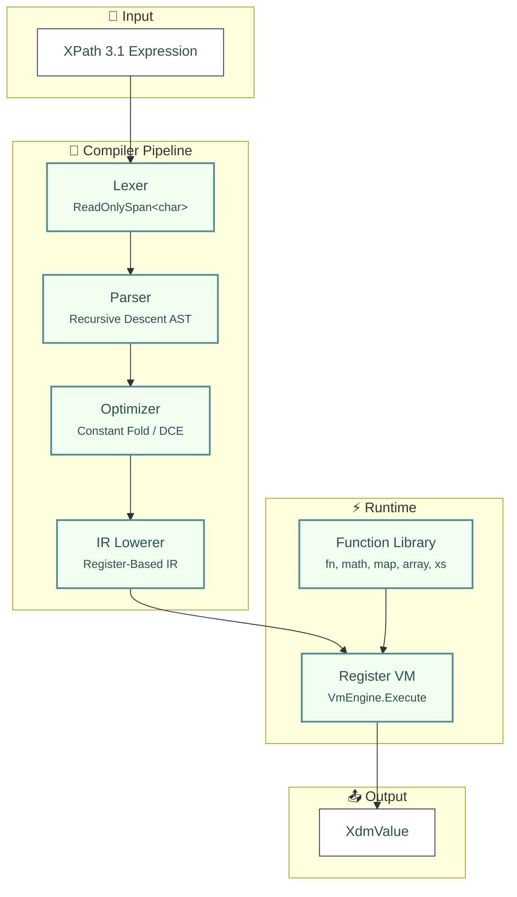

<div align="center">
  
  <br><br>
  <h1>Bosak XPath</h1>
  <p>A high-performance, XDM-first XPath 3.1, XSLT 3.0 and XQuery 3.1 engine for .NET — with opt-in XPath/XSLT 4.0</p>
</div>

<div align="center">

[](https://dotnet.microsoft.com/)
[](license.md)
[]()
[](https://www.nuget.org/packages/Bosak.XPath.Api)
[](https://github.com/Fytala-Charles/Bosak/actions/workflows/ci.yml)
[](docs/ARCHITECTURE.md)

</div>

--- 
## About FYTALA

**FYTALA — Feeling Young, Thriving, Active, Learning Always** — is a personal initiative founded after retirement, driven by the belief that curiosity, enthusiasm, and learning have no age limit.

It is about staying engaged, exploring new ideas, and sharing the excitement of technology and innovation with others. A special ambition of FYTALA is to spark that enthusiasm in young people and encourage them to discover how fascinating technology can be—not just by talking about technology, but by making it visible, tangible, surprising, and fun.

My dream captures that ambition perfectly: **to walk into a classroom one day, side by side with a humanoid robot, and make my enthusiasm for technology and innovation contagious.**

If that experience inspires even a few young minds to start asking questions, experimenting, building, programming, or imagining what might be possible, FYTALA has achieved something worthwhile.

Technology, after all, is not just about machines, electronics, or software. It is about curiosity, creativity, and turning ideas into reality. FYTALA therefore takes a deliberately broad perspective, embracing software, electronics, engineering, science, artificial intelligence, robotics, and whatever comes next.

> Experimenting matters.
>
> Making mistakes matters.
>
> Understanding *why* something works matters even more.

Every project is an opportunity to learn something new and, hopefully, to help someone else learn as well.

The cable-stayed bridge in the FYTALA logo represents that philosophy. A bridge connects places, but it can also connect people, ideas, generations, and fields of knowledge. Its strength comes from many individual elements working together—much like technology itself.

FYTALA wants to help build those bridges: between experience and youthful curiosity, theory and practice, and imagination and real-world creation. It encourages looking beyond the obvious, asking questions, taking things apart, and building them again in new ways.

Above all, FYTALA is about keeping the desire to discover alive—and passing that desire on to the next generation.

> Because we never have to stop being curious.
>
> We never have to stop creating.
>
> And we are never too old—or too young—to learn something new.


---

## Overview

**Bosak** is a ground-up .NET implementation of **XPath 3.1** (with forward-compatibility for 4.0), with full **XSLT 3.0** and **XQuery 3.1** processors built on the same expression engine.

**XPath/XSLT 4.0 (opt-in, 1.0).** Bosak 1.0 ships the first complete adoption wave of the XPath/XSLT 4.0 drafts behind a version gate: `CompileOptions.Compatibility = XPathCompatibility.XPath40` opts in to 4.0-only F&O functions, keyword arguments, string templates, the `??`/`->`/`=!>` operators, focus functions, enum/choice/record item types, `for member`/`for key value` bindings, and the XSLT 4.0 surfaces (`xsl:note`, `xsl:if` then/else, separators, `xsl:map` select/duplicates, `xsl:array`, `xsl:switch`) — with XPath 3.1 behavior bit-identical by default (QT3 31,142/0/679 preserved exactly). See `docs/REQ-118-xpath-xslt-40.md`.

The project is named for **Jon Bosak**, who chaired the W3C working groups that created XSLT and XPath and donated the XML logo to the community — the standards this engine implements.

Unlike `System.Xml.XPath`, Bosak is built on the **W3C XQuery Data Model (XDM)** from day one. Expressions are compiled once to an intermediate representation (IR) and executed many times on a lightweight, register-based virtual machine. XSLT and XQuery reuse the same XPath engine for all expression evaluation.

### Key Features

- **XDM-First Architecture** — All inputs are adapted to `IXdmNode`; no proprietary DOM lock-in
- **Compile Once, Execute Many** — Parse → Optimize → Lower to IR → VM execution
- **Zero-Allocation Sequences** — Lazy struct enumerators avoid `IEnumerable<T>` boxing on hot paths
- **Pluggable Backends** — Works with `XDocument`, `XmlDocument`, streaming readers, or custom `IXdmNode` providers
- **XPath 3.1 Complete** — Maps, arrays, higher-order functions, arrow expressions (`=>`), string concat (`||`), FLWOR, JSON functions
- **XPath/XSLT 4.0 (opt-in)** — 4.0-only F&O functions (`fn:replicate`, `fn:slice`, `fn:parse-uri`, `map:build`, …), keyword arguments, string templates, `??`/`->`/`=!>`, focus functions, enum/choice/record item types, `for member`/`for key value`, and XSLT 4.0 instructions (`xsl:note`, `xsl:array`, `xsl:switch`, …) behind `CompileOptions.Compatibility`; default 3.1 behavior is bit-identical
- **XSD Regex with Pinned Unicode 9.0** — Full `\p{X}`/`\P{X}` category and `\p{IsBlock}` support, class subtraction, astral-safe matching
- **XSLT 3.0 Transform Engine** — Template matching, sequence constructors, `xsl:copy`/`xsl:copy-of`, `xsl:for-each-group`, `xsl:analyze-string`, `xsl:where-populated`, `xsl:on-empty`, `xsl:iterate`/`xsl:break`, `fn:transform()`
- **Burst-Mode Streaming Input** — `XmlStreamingProvider` + `XsltExecutable.TransformStreaming`/`TransformStreamingToString` process multi-GB record documents in bounded memory (verified at 500k records); forward-only with loud errors instead of silent data loss; pre-root comment/PI parity with the in-memory provider; push-style streaming accumulators (`xsl:accumulator` works over the stream)
- **XQuery 3.1 (Phase 4)** — full core FLWOR, direct and computed constructors, switch/typeswitch, `validate` (`strict`/`lax`/`type QName`), output declarations and serialization, user-defined functions and variables, library modules (`import module` with %public/%private visibility), schema-aware user-defined simple types, QName/NOTATION preservation and ID/IDREF detection, higher-order function item instance-of over element kind tests, empty `document-node()` matching, constructed-element `xs:anyType` annotations, QName accessor singleton-sequence XPTY0004, function return-type atomization for user-defined schema types, keywords as unprefixed function names, instance-of type-hierarchy semantics for user-defined schema types; schema-aware `fn:json-to-xml` with `validate:=true()` against the W3C schema-for-JSON; QT3 wired (31,142/0/679 strict — 100% of runnable)

---

## Quick Start

```bash
dotnet add package Bosak.XPath.Api    # XPath entry point
# or: dotnet add package Bosak.Xslt   # XSLT 3.0 transforms
# or: dotnet add package Bosak.XQuery  # XQuery 3.1 queries
```

```csharp
using Bosak.XPath.Api;
using Bosak.XPath.Core.Xdm;

// Compile once (XPathExpression is the version-neutral entry point;
// XPath31Expression remains fully supported)
var expr = XPathExpression.Compile("$price * (1 + $taxRate)");

// Execute many times with different inputs
var ctx = new EvaluationContext()
    .WithVariable("price", XdmValue.FromDecimal(100.00m))
    .WithVariable("taxRate", XdmValue.FromDecimal(0.21m));

var result = expr.Evaluate(ctx);
Console.WriteLine(result.DecimalValue); // 121.00
```

### XPath/XSLT 4.0 opt-in

```csharp
// Opt into the XPath 4.0 surfaces (default stays XPath 3.1, bit-identical)
var expr40 = XPathExpression.Compile(
    "fn:substring('hello', start := 2)",
    new CompileOptions { Compatibility = XPathCompatibility.XPath40 });
```

### Conditional Expressions

```csharp
var expr = XPath31Expression.Compile(
    "if ($score ge 90) then 'A' else if ($score ge 80) then 'B' else 'C'");
```

### Sequence & Range

```csharp
var expr = XPath31Expression.Compile("1 to 5");
// Returns: [1, 2, 3, 4, 5]
```

### XQuery 3.1

```csharp
using Bosak.XQuery.Api;
using Bosak.XPath.Core.Xdm;

var query = new XQueryCompiler().Compile("for $i in 1 to 3 return $i * $i");
var result = query.Evaluate(new XQueryContext());

foreach (var item in XdmSequence.FromSource(result.SequenceValue!))
    Console.WriteLine(item.IntegerValue);
// => 1 4 9
```

---

## Architecture


```mermaid
flowchart TB
    subgraph Input["📄 Input"]
        XPATH["XPath 3.1 Expression"]
    end

    subgraph Compiler["🔧 Compiler Pipeline"]
        LEXER["Lexer<br/><small>ReadOnlySpan&lt;char&gt;</small>"]
        PARSER["Parser<br/><small>Recursive Descent AST</small>"]
        OPTIMIZER["Optimizer<br/><small>Constant Fold / DCE</small>"]
        LOWERER["IR Lowerer<br/><small>Register-Based IR</small>"]
    end

    subgraph Runtime["⚡ Runtime"]
        VM["Register VM<br/><small>VmEngine.Execute</small>"]
        FUNCS["Function Library<br/><small>fn, math, map, array, xs</small>"]
    end

    subgraph Output["📤 Output"]
        XDM["XdmValue"]
    end

    XPATH --> LEXER
    LEXER --> PARSER
    PARSER --> OPTIMIZER
    OPTIMIZER --> LOWERER
    LOWERER --> VM
    VM --> XDM
    FUNCS --> VM

    classDef current fill:#F0FFF0,stroke:#518D8F,color:#2F4F4F,stroke-width:2px
    classDef external fill:#FFFFFF,stroke:#293F5F,color:#2F4F4F

    class LEXER,PARSER,OPTIMIZER,LOWERER,VM,FUNCS current
    class XPATH,XDM external
```

### Layer Stack

| Layer | Project | Responsibility |
|-------|---------|----------------|
| **Public API** | `Bosak.XPath.Api` | `XPathExpression` (version-neutral), `XPath31Expression`, `CompileOptions`, `EvaluationContext` |
| **Standard Library** | `Bosak.XPath.Standard` | `fn:*`, `math:*`, `map:*`, `array:*`, `xs:*` constructors |
| **Runtime / VM** | `Bosak.XPath.Runtime` | `VmEngine`, function dispatch, sequence operators |
| **Compiler / IR** | `Bosak.XPath.Compiler` | `XPathOptimizer`, `IrLowerer`, bytecode emitter |
| **Parser** | `Bosak.XPath.Parser` | `XPathLexer`, `XPathParser`, AST nodes |
| **XDM Core** | `Bosak.XPath.Core` | `XdmValue`, `IXdmNode`, `XdmSequence`, axis kinds |
| **Node Providers** | `Bosak.XPath.Providers` | `XDocument`, `XmlDocument`, burst-mode streaming (`XmlStreamingProvider`) |
| **XSLT** | `Bosak.Xslt` | `XsltCompiler`, `TransformEngine`, `fn:transform()` |
| **XQuery** | `Bosak.XQuery` | `XQueryCompiler`, `XQueryExecutable`, `XQueryParser`, `XQueryStaticContext`; full core FLWOR + direct and computed constructors + switch/typeswitch + output declarations and serialization + user-defined functions/variables + library modules + schema-aware user-defined simple types; QT3 wired (31,142/0/679 strict — 100% of runnable) |
| **Language Server** | `Bosak.LanguageServer` | LSP server for XPath / XSLT / XQuery — diagnostics, completions, hover, go-to-definition, document outline, semantic tokens, code actions, code lens |
| **VS Code Extension** | `vscode-bosak/` | TypeScript client for the language server |

---

## Performance Strategy

| Technique | Application |
|-----------|-------------|
| `ReadOnlySpan<char>` | Lexer, string comparisons, name tests |
| Struct enumerators | `XdmSequence`, axis iteration |
| `ArrayPool<T>` | Temporary buffers during sorting / materialization |
| Lazy evaluation | Sequences, predicates, path steps |
| Register VM | Expression execution (better cache locality than tree walking) |
| IL JIT *(future)* | Hot expression compilation to `DynamicMethod` |

---

## Roadmap

| Phase | Deliverable | Status |
|-------|-------------|--------|
| 1 | XPath 3.1 Core — compiler + VM + standard functions | ✅ Complete |
| 2 | XSLT 2.0/3.0 — template matching, sequence constructors, `fn:transform()` | ✅ Complete — full option surface + QT3 Tier-2m (117/124 passed, 7 skipped) |
| 3 | XQuery 3.1 — prolog parser, static context, prolog-less queries, full core FLWOR | 🚧 Phase 4 (constructors, modules, serialization, HOF, `fn:load-xquery-module`, schema-aware user-defined simple types, `validate`, QName/NOTATION/ID support, QName accessor singleton-sequence XPTY0004, function return-type atomization for user-defined schema types, schema-aware `fn:json-to-xml`); QT3 wired (31,142/0/679 strict — 100% of runnable) |
| 4 | Streaming — `XmlReader`-backed `IXdmNode` | ✅ Phases A+B+C+D — burst-mode streaming input (`XmlStreamingProvider`, `TransformStreaming`, `TransformStreamingToString`) + push-style streaming accumulators + `streamable="yes"` (§19 analyzer + runtime posture); provider batch: per-node wrapper cache, pre-root comment/PI surfacing, `fn:copy-of` deep-copy guard; PC-1 streaming conformance cluster closed (REQ-117 — all 26 FAIL→PASS, schema-aware sweep 11,054/1, 2026-10-02) |
| 5 | Database backends — XML database adapters | 🚧 **In Progress — Slice 2 done: basex/exist/marklogic REST scheme registry** (`Bosak.XPath.Providers.Database`; `Bosak.` NuGet prefix **reserved 2026-10-05**); dossier `docs/REQ-120-database-backends.md` |
| 6 | XPath/XSLT 4.0 adoption (REQ-118) | 🚧 **Wave 1 landed in 1.0.0 (slices S0–S8)** — stabilized draft features behind the default-3.1 version gate: 4.0-only F&O functions, keyword arguments, string templates, `??`/`->`/`=!>`, focus functions, enum/choice/record item types, `for member`/`for key value`, and XSLT 4.0 instructions (`xsl:note`, `xsl:if` then/else, separators, `xsl:map` select/duplicates, `xsl:array`, `xsl:switch`); next: a '4.0 Experimental' compatibility level (1.1.0), qt4tests harness, `fn:parse-html`; dossier `docs/REQ-118-xpath-xslt-40.md` |

**1.0 (GA):** ✅ **shipped 2026-10-09** — the within-major SemVer commitment now applies; see [ROADMAP.md](ROADMAP.md) and the [v1.0.0 release notes](docs/RELEASE-NOTES-1.0.md). The commercial Bosak.Schema 1.0 tags as the paired release (see the Bosak.Schema roadmap).

---

## Support

The open-source library is **community-supported and free forever** (Apache-2.0):

- **Questions & usage help** → [GitHub Discussions](https://github.com/Fytala-Charles/Bosak/discussions) (Q&A category)
- **Bugs & feature requests** → [GitHub Issues](https://github.com/Fytala-Charles/Bosak/issues)
- **Engine correctness work** — conformance fixes and correctness improvements are always done in the open; they are never paywalled

For guaranteed response times, direct engineering access, priority triage, or custom development, Fytala offers [commercial support contracts](COMMERCIAL.md). A future "Bosak Pro" add-on is planned for advanced schema-awareness scenarios; the conformant engine core stays Apache-2.0 regardless.

---

## Sponsorship

Bosak is free and open source (Apache-2.0) — and stays that way. Core conformance fixes and correctness work are always done in the open; they are never paywalled. If Bosak is useful to you, consider supporting its development through [GitHub Sponsors](https://github.com/sponsors/Fytala-Charles). Sponsorship does two things:

1. **Keeps Bosak moving** — conformance hardening, the VS Code extension, XQuery depth, and the road to a 1.0 release. Sponsors get a voice: roadmap votes and priority issue triage.
2. **Funds a mission close to Fytala's heart** — sparking enthusiasm for technology and innovation in young people, showing the next generation that building deep, beautiful software is something they can do too.

| Tier | Name | Benefits |
|------|------|----------|
| €3 / month | ☕ Supporter | Support Bosak and the youth-technology mission; your GitHub handle listed as a supporter in release notes |
| €10 / month | 🚀 Enthusiast | Everything above, plus votes on roadmap priorities and priority issue triage |
| €25 / month | 💎 Professional | Everything above, plus a direct line for integration questions and early input on new features |
| €100 / month | 🏢 Organization | Everything above, plus your logo and link in the Bosak README and release notes |

Every contribution, however small, is genuinely appreciated. Current sponsors are listed in [SPONSORS.md](SPONSORS.md) and acknowledged in release notes.

---

## VS Code Extension

A Language Server Protocol (LSP) implementation and VS Code extension provide IDE features for XPath, XSLT, and XQuery development — syntax highlighting, semantic tokens, diagnostics, completion, hover, go-to-definition, document outline, code actions (quick fixes), code lens for `.xpath`/`.xq`/`.xqy`/`.xquery` results, XSLT **Run XSLT transformation** and **Run initial template** lenses, `workspace/executeCommand` evaluation, and evaluate/run commands.

### Quick Install

```bash
# 1. Build the language server
dotnet build src/Bosak.LanguageServer/Bosak.LanguageServer.csproj

# 2. Build the extension
cd vscode-bosak
npm install
npm run compile

# 3. Open in VS Code and press F5 to launch the Extension Development Host
```

The extension is published on the VS Code Marketplace as [**Bosak XPath / XSLT**](https://marketplace.visualstudio.com/items?itemName=fytala.vscode-bosak) (`fytala.vscode-bosak`, 0.1.5, 2026-10-07). See [`vscode-bosak/README.md`](./vscode-bosak/README.md) for full installation options (Marketplace, VSIX, custom server path, troubleshooting).

---

## Building

```bash
dotnet build Bosak.sln
dotnet test Bosak.sln
```

Target framework: **.NET 10**.

All 3,320 unit tests pass (0 failures) across 10 assemblies, plus 72 in the separate Bosak.LanguageServer project (not in `Bosak.sln`).

---

## Conformance Testing

Bosak includes a W3C QT3 test suite harness for measuring XPath 3.1 standards compliance.

### Running the Harness

```bash
# Build the conformance runner
dotnet build tests/Bosak.XPath.Conformance/Bosak.XPath.Conformance.csproj

# Run against the full QT3 suite (~32,000 tests across 428 test sets)
dotnet run --project tests/Bosak.XPath.Conformance/Bosak.XPath.Conformance.csproj
```

The harness:
1. Discovers all test sets from `tests/qt3tests/catalog.xml`
2. Filters out unsupported features (schema-aware, XSLT streaming-only, serialization, static typing)
3. Routes XQuery-syntax tests through the `Bosak.XQuery` pipeline; evaluates the rest via the public `XPath31Expression.Compile(expr).Evaluate(ctx)` API
4. Executes each test with environment-defined namespaces, variables, and context documents wired in
5. Compares results against QT3 assertions (`assert-eq`, `assert-true`, `assert-xml`, etc.) with strict error-code matching

### Current Results

| Metric | Value |
|--------|-------|
| **XPath/XQuery (QT3)** | 428 test sets, ~32,000 tests |
| Pass Rate (XPath+XQuery) | **31,142 passed / 0 failed / 679 skipped** (97.87%) with strict error-code matching (2026-10-02 re-run, bit-identical to the 2026-09-09 baseline) — **100%** of runnable tests pass |
| **XSLT 3.0** | 224 test sets, 14,601 tests |
| Pass Rate (XSLT, basic sweep) | **10,242 passed / 0 failed / 4,359 skipped** (100.0% of runnable, harness 3.73, 2026-10-06 — the 26 formerly-failing tests are upstream catalog artifacts, skipped with reason per `docs/BASIC_SWEEP_TRIAGE.md` / w3c/xslt30-test#90) |
| Pass Rate (XSLT, schema-aware sweep) | **11,054 passed / 1 failed / 3,546 skipped** (100.0% of non-skipped, final gate 2026-10-03) — the single failure is `type-functions-0401` (DateTimeOffset year < −1, documented platform limitation); the non-streaming + streaming conformance tail is fully closed |
| unicode-90 set | **1,365 passed / 0 failed / 95 skipped** (skips are upstream test/data defects) |
| Unsupported Features | Complex-type schema awareness ships via the commercial **Bosak.Schema** add-on (Beta, `v0.2.0`); the free core raises XTSE1650 for `xsl:import-schema` unless the schema-aware seam is activated — see `COMMERCIAL.md`. XQuery-only dependencies |

> **Strict error matching** — Both conformance harnesses now require the declared
> `<error code="...">` to match the raised exception; previously any error satisfied an error
> expectation. The XSLT strict count (2026-09-01) exposed 147 tests that passed with a wrong
> error code (lenient figure 7,627/103/6,870). The QT3 strict tightening (2026-09-07) exposed
> 1,200 wrong-code passes; the triage fixed ~970 of them — cast-matrix error codes, static
> XPST0003/XPST0081/XPST0008 checks at parse/compile time, XQDY0054 dynamic detection,
> FOER0000 structural matching — leaving 233 triaged failures (documented engine gaps:
> schema list-type casts, extreme date/time ranges, JSON parse error-code granularity). No
> genuinely passing test was lost in either sweep.

### Known Limitations

| Assertion | Status | Impact |
|-----------|--------|--------|
| `assert-eq` | ✅ Implemented | Core value comparison |
| `assert-count` | ✅ Implemented | Sequence cardinality |
| `assert-deep-eq` | ✅ Implemented | Recursive XDM comparison |
| `assert-xml` | ⚠️ Partial | ~1,840 tests skipped |
| `assert-permutation` | ❌ Not implemented | ~92 tests skipped |
| Schema-aware | ⚠️ Opt-in (REQ-097) | ~5,000+ tests skipped — XSLT schema-aware compilation compiles `xsl:import-schema` and supports user-defined simple types via `SchemaAware` / `SchemaResolver` / `SchemaSet`; complex-type typed construction and runtime validation (`validation`/`@type`, XTTE15xx family) are implemented in the core behind the same opt-in (REQ-098–REQ-117 — last schema-aware sweep **11,054 passed / 1 failed / 3,546 skipped**; the single failure is type-functions-0401, a documented DateTimeOffset year platform limitation) |

### Adding New Tests

The harness is intentionally thin — it validates the **public API surface** end-to-end rather than calling internal layers directly. This ensures that parser, compiler, VM, and standard-library fixes are all exercised together.

---

<div align="center" style="background:#2F4F4F; color:#F0FFF0; padding:1rem; border-radius:12px; margin-top:2rem;">
  <p style="margin:0; font-family:Poppins,Segoe UI,sans-serif;">
    <strong>© Fytala</strong> — Bosak XPath Engine
  </p>
</div>
