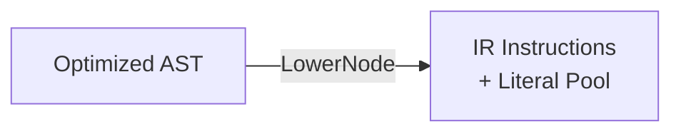
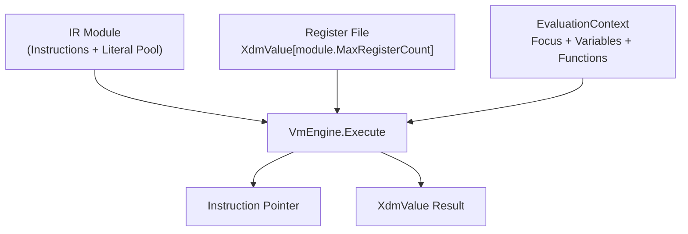
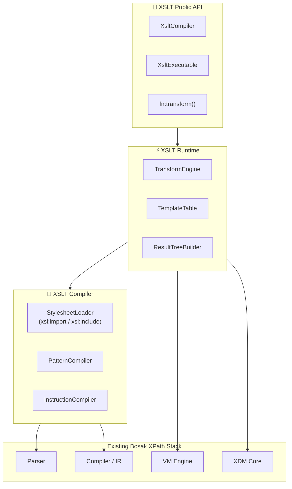

<div align="center">
  
  <br><br>
  <h1 style="color:#2F4F4F; font-family:Poppins,Segoe UI,sans-serif; margin:0;">Bosak XPath Architecture</h1>
  <p style="color:#556B2F; font-family:Poppins,Segoe UI,sans-serif; font-size:1rem; margin:0.5rem 0 0;">
    Technical design document — XPath 3.1 register-VM engine
  </p>
</div>

<br>

---

## Overview

A high-performance .NET implementation of **XPath 3.1** (with forward-compatibility for 4.0), serving as the expression-engine foundation for the XSLT 3.0 processor and the planned XQuery 3.1 processor.

## Guiding Principles

1. **XDM-First**: XPath operates on the W3C XQuery Data Model (XDM), not raw XML DOM. All inputs are adapted to XDM.
2. **Compile Once, Execute Many**: Expressions are parsed into an AST, optimized, lowered to an Intermediate Representation (IR), and then compiled to a register-based VM. Hot paths can be JIT-compiled to IL.
3. **Zero-Allocation Sequences**: Sequences are lazily evaluated using struct enumerators. We avoid `IEnumerable<T>` boxing on hot paths.
4. **Value Semantics**: XDM values are immutable. Small values (integers, doubles, booleans) are unboxed structs.
5. **Pluggable Backends**: XML can be sourced from `XDocument`, `XmlDocument`, streaming readers, databases, or custom implementations without copying into a proprietary DOM.
6. **Standards Compliance**: XPath 3.1 and XDM 3.1 are the baseline. The type system and function signature model must support higher-order functions and JSON literals for XPath 3.1.

---

## High-Level Architecture

```mermaid
flowchart TB
    subgraph API["📢 Public API"]
        EXP["XPath31Expression"]
        COMP["XPathCompiler"]
        ECTX["EvaluationContext"]
    end

    subgraph STD["📚 Standard Library"]
        FN["fn:*"]
        MATH["math:*"]
        MAP["map:*"]
        ARR["array:*"]
        XS["xs:* constructors"]
    end

    subgraph RT["⚡ Runtime / VM"]
        VM["Register VM"]
        FD["Function Dispatch"]
        SO["Sequence Operators"]
    end

    subgraph CP["🔧 Compiler / IR"]
        ASTO["AST Optimizer"]
        IRL["IR Lowerer"]
        JIT["IL JIT (optional)"]
    end

    subgraph PR["📝 Parser"]
        LEX["Lexer (Span-based)"]
        PAR["Recursive-Descent Parser"]
        AST["AST"]
    end

    subgraph XC["🧱 XDM Core"]
        XV["XdmValue"]
        XN["IXdmNode"]
        XSQ["XdmSequence"]
        XAV["XdmAtomicValue"]
    end

    subgraph NP["🌐 Node Providers"]
        XD["XDocument"]
        XMLD["XmlDocument"]
        STR["Streaming"]
        CUST["Custom"]
    end

    API --> STD
    STD --> RT
    RT --> CP
    CP --> PR
    PR --> XC
    XC --> NP
```



---

## Layer Details

### 1. XDM Core (`Bosak.XPath.Core`)

The XQuery Data Model is the foundation. Every XPath expression evaluates to an XDM value.

#### `XdmValue` (Struct)
A discriminated-union struct representing any XDM value:
- **Atomic**: `xs:string`, `xs:integer`, `xs:decimal`, `xs:double`, `xs:boolean`, `xs:date`, etc.
- **Node**: A handle to an `IXdmNode`.
- **Sequence**: A lazy sequence of `XdmValue`.
- **Function**: Function items (higher-order functions in XPath 3.1).
- **External**: Opaque .NET objects passed into the query.

```csharp
public readonly struct XdmValue
{
    private readonly XdmValueKind _kind;
    private readonly object? _reference; // Nodes, sequences, functions, strings
    private readonly ulong _bits;       // Union overlay for numerics/bools
    // ~32 bytes total
}
```

**Performance notes**:
- Small integers, booleans, and doubles are stored inline in `_bits` (unboxed).
- Strings and larger objects use the `_reference` field.
- Sequences are **not** `List<XdmValue>`. They are lazy `IXdmSequence` objects.

**Effective boolean value**: `XdmValue.EffectiveBooleanValue()` follows XPath 3.1 rules — empty sequence is `false`, a singleton sequence delegates to its item, a multi-item sequence is `true` only if it contains a node, and a multi-item purely atomic sequence raises `FORG0006`.

#### `IXdmNode` (Interface)
An abstraction over any XML node. Implementations are provided for `XDocument`, `XmlDocument`, streaming, etc.

```csharp
public interface IXdmNode
{
    XdmNodeKind NodeKind { get; }
    string LocalName { get; }
    string NamespaceUri { get; }
    string Prefix { get; }
    string StringValue { get; }
    string BaseUri { get; }
    string DocumentUri { get; }  // separate from BaseUri; empty for temporary trees

    IXdmNode? Parent { get; }
    XdmSequence Children(XdmNodeKind kind = XdmNodeKind.All);
    XdmSequence Attributes(string? localName = null, string? namespaceUri = null);

    // Axis navigation returns lazy sequences
    XdmSequence Axis(XdmAxis axis);
}
```

#### `XdmSequence` (Struct + Enumerator Pattern)
A lazy, struct-backed sequence with zero-allocation enumeration.

```csharp
public readonly struct XdmSequence
{
    private readonly IXdmSequence? _source;
    
    public Enumerator GetEnumerator() => new(_source);
    
    public struct Enumerator : IEnumerator<XdmValue>
    {
        // Struct enumerator: no allocation
    }
}
```

**Why not `IEnumerable<XdmValue>`?**
- Boxing on foreach is unacceptable for high-performance path evaluation.
- Struct enumerators give us C# `foreach` syntax with zero allocations.
- LINQ-style operators (`Where`, `Select`) are reimplemented as struct-returning methods.

---

### 2. Parser (`Bosak.XPath.Parser`)

A hand-written, recursive-descent parser using `ReadOnlySpan<char>` for zero-allocation tokenization.

**Why hand-written?**
- XPath grammar is small but context-sensitive (e.g., `*` can be multiply or `any-name`).
- `ReadOnlySpan<char>` gives us O(1) substring slicing without `Substring` allocations.
- Full control over error messages and recovery.

**Pipeline**:
1. **Lexer**: Tokenizes the XPath string. Tokens contain `(TokenKind, ReadOnlySpan<char>)`.
2. **Parser**: Recursive descent into an AST.
3. **AST**: A simple immutable tree of `XPathAstNode` records.

---

### 3. Compiler (`Bosak.XPath.Compiler`)

Transforms the AST into an executable form.

#### Phase 1: AST Optimizer
- Constant folding (`1 + 2` → `3`), preserving XPath 1.0 negative-zero semantics for unary minus on integer zero
- Predicate analysis (`[1]` → `First()`, `[last()]` → `Last()`)
- Axis merging (`child::foo` + `child::bar` where possible)
- Dead code elimination

#### Phase 2: IR Lowerer
Lowers the AST to a **register-based intermediate representation** (`IrInstruction`). This is similar to LLVM IR but domain-specific for XPath.



Example IR for `//book[price > 10]`:
```
LOAD_CONTEXT     r0
DESCENDANT_AXIS  r1, r0, "book"
FILTER           r2, r1, label_1
RETURN           r2

label_1:
CHILD_AXIS       r3, r0, "price"
ATOMIC_VALUE     r4, r3
GREATER_THAN     r5, r4, 10
RETURN           r5
```

#### Phase 3: Bytecode Emitter
Emits the IR into a compact format. `IrInstruction` is an 11-byte struct (`IrOpCode` + 3×`ushort` registers + `int` operand) with `Pack=1`.

#### Phase 4: IL JIT (Optional / Future)
For expressions executed frequently (>N times), the IR can be compiled to a `DynamicMethod` using `System.Linq.Expressions` or `System.Reflection.Emit` for near-native performance.

---

### 4. Runtime / VM (`Bosak.XPath.Runtime`)

A lightweight, register-based virtual machine.



**Design**:
- Dynamically-sized `XdmValue` register array sized to the module's max register count (up to 65,536 registers).
- Instruction pointer walks the bytecode.
- Axis instructions delegate to the `IXdmNode` provider.
- Function calls dispatch through a vtable in `EvaluationContext`.
- `EvaluationContext.ImplicitTimezoneOffsetMinutes` supplies the dynamic context's implicit timezone (default UTC) for date/time comparisons and `adjust-*-to-timezone#1`.

**Performance features**:
- **Sequence pipelining**: Axis results are not buffered unless required by sorting or positional predicates.
- **Predicate short-circuiting**: Predicates are evaluated lazily; `//a[b and c]` stops at first false.
- **Document-order preservation**: Maintained by the node provider, not by sorting after the fact.

---

### 5. Standard Library (`Bosak.XPath.Standard`)

Implementation of:
- **fn namespace**: All XPath 3.1 functions (`fn:string`, `fn:concat`, `fn:current-dateTime`, etc.)
- **math namespace**: Trigonometric and logarithmic functions.
- **map namespace**: `map:merge`, `map:get`, etc.
- **array namespace**: `array:size`, `array:get`, etc.
- **xs constructors**: Type constructors cast/validate values.

Each function is implemented as a static method conforming to a delegate signature:
```csharp
public delegate XdmValue XPathFunction(EvaluationContext context, ReadOnlySpan<XdmValue> arguments);
```

Functions are registered in a `FunctionLibrary` that supports runtime extensibility. Functions that accept numeric arguments in XPath 1.0 backwards-compatible mode (e.g. `fn:subsequence`) coerce strings, untyped atomics, and nodes to `xs:double` instead of raising `XPTY0004`.

#### Regular-expression support

Regular expressions are centralized in `RegexHelper` (`src/Bosak.XPath.Standard/Functions/RegexHelper.cs`). It is used by `fn:matches`, `fn:replace`, `fn:tokenize`, `fn:analyze-string`, and `xsl:analyze-string` to:

- Parse `i`, `m`, `s`, `x`, and `q` flags.
- Validate XSD regex syntax and reject invalid patterns (`FORX0002`).
- Translate XSD-specific constructs (e.g. ambiguous backreferences, category escapes) to .NET `Regex` syntax.
- Translate XPath/XSD replacement strings for `fn:replace`.
- Detect patterns that match the empty string (`FORX0003`).
- Build capturing-group parent maps so `fn:analyze-string` emits the correctly nested `<group>` tree required by the spec.

---

### 6. Public API (`Bosak.XPath.Api`)

The user-facing surface, modeled after `System.Xml.XPath` but modernized.

```csharp
// Compile once
var expr = XPath31Expression.Compile("//book[price gt 10]/title");

// Execute many times against different documents
var result = expr.Evaluate(document);
foreach (var title in result.AsNodes())
{
    Console.WriteLine(title.StringValue);
}

// With context (variables, namespaces, functions)
var ctx = new EvaluationContext()
    .WithNamespace("p", "http://example.com")
    .WithVariable("minPrice", new XdmValue(10.0m));

var result2 = expr.Evaluate(document, ctx);

// With default element namespace (XSLT xpath-default-namespace)
var options = new CompileOptions
{
    Namespaces = new Dictionary<string, string> { ["p"] = "http://example.com" },
    DefaultElementNamespace = "http://example.com"
};
var expr3 = XPath31Expression.Compile("//book", options);

// The XML default namespace of the element containing the expression is tracked
// separately so that XSLT's fn:element-available() can expand unprefixed QNames
// per the XSLT specification, independent of xpath-default-namespace.
options = new CompileOptions
{
    DefaultElementNamespace = null,
    DefiningElementDefaultNamespace = "http://www.w3.org/1999/XSL/Transform"
};
```

---

## Performance Strategy

| Technique | Application |
|-----------|-------------|
| `ReadOnlySpan<char>` | Lexer, string comparisons, name tests |
| Struct enumerators | `XdmSequence`, axis iteration |
| `ArrayPool<T>` | Temporary buffers during sorting, sequence materialization |
| Lazy evaluation | Sequences, predicates, path steps |
| Register VM | Expression execution (better cache locality than tree walking) |
| IL JIT (future) | Hot expression compilation to `DynamicMethod` |
| QName interning | `StringPool` for element/attribute names |
| Avoid `System.Xml.XmlNode` | `IXdmNode` adapter pattern prevents DOM locking |

---

## Extensibility Roadmap

| Phase | Deliverable | Status |
|-------|-------------|--------|
| 1 | XPath 3.1 Core | Expression compiler + standard functions ✅ |
| 2 | XSLT 2.0 / 3.0 | Template matching, sequence constructors, `fn:transform()` ✅ |
| 3 | Language Server | LSP diagnostics & completions for XPath / XSLT in VS Code ✅ |
| 4 | XQuery 3.1 | FLWOR expressions, query prolog. Reuses XPath engine entirely. 📋 Planned |
| 5 | Streaming | `IXdmNode` backed by `XmlReader` with look-ahead constraints. 📋 Planned |
| 6 | Database backends | `IXdmNode` implementations over XML databases. 📋 Planned |

---

## XSLT Architecture & Roadmap

XSLT is implemented as a **thin compiler/runtime layer** on top of the existing XPath stack. The XPath engine (parser, compiler, VM, XDM) handles all expression evaluation; XSLT adds stylesheet parsing, pattern compilation, template dispatch, and result-tree construction.



### XSLT Project Structure

```
src/
  Bosak.Xslt/
    Stylesheet/          Stylesheet DOM, template rule table, import/include resolution
    Patterns/            Pattern AST, pattern compiler, match predicate generation
    Instructions/        XSLT instruction compiler (apply-templates, for-each, value-of, etc.)
    Runtime/             Transform engine, result-tree builder, built-in template rules
    Api/                 XsltCompiler, XsltExecutable, public surface
```

### XSLT Implementation Phases

#### Phase 1 — EDI Conversion Core (XSLT 2.0 subset)
**Goal:** Unblock Customer A EDI transforms (Canonical XML ↔ BOD).

| Feature | Status | Notes |
|---------|--------|-------|
| `xsl:stylesheet` / `xsl:transform` | 🎯 Phase 1 | Root element parsing |
| `xsl:template` with `match` | 🎯 Phase 1 | Pattern compilation for element names, wildcards, predicates, union |
| `xsl:template` with `name` | 🎯 Phase 1 | Named template invocation |
| `xsl:apply-templates` | 🎯 Phase 1 | Default mode, `select` attribute |
| `xsl:call-template` | 🎯 Phase 1 | Named template calls with `xsl:with-param` |
| `xsl:value-of` | 🎯 Phase 1 | Text node construction |
| `xsl:copy` | 🎯 Phase 1 | Shallow copy; `@select` attribute support |
| `xsl:copy-of` | 🎯 Phase 1 | Deep copy to result tree |
| `xsl:for-each` | 🎯 Phase 1 | Iteration over sequence |
| `xsl:if` / `xsl:choose` | 🎯 Phase 1 | Conditional logic |
| `xsl:variable` / `xsl:param` | ✅ Implemented | Scoped variables and parameters; static variables/parameters supported with external override; compile-time validation of required/disallowed attributes and `required`/`select` combinations |
| `xsl:element` / `xsl:attribute` | 🎯 Phase 1 | Dynamic element/attribute construction |
| `xsl:text` | 🎯 Phase 1 | Literal text output |
| Built-in template rules | 🎯 Phase 1 | Default handling for text, attributes, elements |
| `xsl:import` / `xsl:include` | 🎯 Phase 1 | **Required for Customer A:** modular stylesheets, shared function libraries |
| `xsl:output` | 🎯 Phase 1 | Serialization method, encoding, indentation |
| `xsl:sort` | ✅ Implemented | Sorting within `xsl:apply-templates` / `xsl:for-each` |
| `xsl:number` | ✅ Implemented | Number formatting |
| `xsl:key` / `key()` | ✅ Implemented | Indexed lookup |
| Modes (named) | ✅ Implemented | `mode="foo"`, `xsl:apply-templates mode` |
| `xsl:function` | ✅ Implemented | User-defined XPath functions in XSLT; `@name` and `@_name` AVTs are resolved to expanded QNames at parse time using the stylesheet static context (including externally supplied static parameters), with duplicate-name and invalid-name validation |
| Shadow attributes (`_{attr}` static AVTs) | ✅ Implemented | Underscore-prefixed XSLT attributes (e.g. `_version`, `_href`, `_use-when`, `_xpath-default-namespace`, `_static`, `_select`) are evaluated as AVTs at compile time in the current static context and replace the corresponding non-underscore attributes. Shadow attributes on literal result elements are ignored. |
| `fn:transform()` | ✅ Implemented | XPath function invoking XSLT from expressions |
| Tunnel parameters | ✅ Implemented | `tunnel="yes"` propagation |
| `xsl:mode` | ✅ Implemented | `on-no-match`, `on-multiple-match`, `warning-on-no-match`, `warning-on-multiple-match`, `visibility`, `typed`, `streamable`, `default-mode`, duplicate-declaration checks, and `#unnamed` normalization |
| `xsl:analyze-string` | ✅ Implemented | Regex matching/non-matching children; `regex-group()`; XSLT 3.0 zero-length match semantics |
| `xsl:try` / `xsl:catch` | ✅ Implemented | Error variables (`err:code`, `err:description`, `err:value`, ...); global-variable errors propagate uncaught |
| `xsl:result-document` | ✅ Implemented | Secondary result documents, URI conflict detection, nested principal output, `rollback-output` handling |
| `xsl:iterate` | ✅ Implemented | Stateful iteration with `xsl:param`, `xsl:next-iteration`, `xsl:break`, and `xsl:on-completion` in result-tree and function-body contexts; `iterate` conformance cluster 44/44 |
| XSLT 3.0 packages | 🔮 Phase 3 | `xsl:package`, `xsl:use-package` |
| Streaming | 🔮 Phase 3 | `streamable="yes"` (skeletal support only) |

> **Implementation note:** `TransformEngine.ExecuteXsltInstruction` treats `xsl:fallback`, `xsl:sort`, `xsl:on-empty`, `xsl:on-non-empty`, and `xsl:assert` as no-ops when reached directly. `xsl:sort` is consumed by its parent sorting instruction; `xsl:on-empty`/`xsl:on-non-empty` are handled by dedicated sequence-constructor processing; `xsl:fallback` is processed only as a child of an unrecognized/extension instruction; `xsl:assert` is accepted but not yet evaluated (pending an enable-assertions switch).
>
> **Serialization:** `ResultTreeSerializer` honours `xsl:output`/`xsl:result-document` properties including `method`, `encoding`, `indent`, `omit-xml-declaration`, and `normalization-form`. Multiple `xsl:output` declarations are merged (later values override earlier ones), and a principal `xsl:result-document`'s properties are captured so `TransformToString` serializes with the correct encoding and Unicode normalization. The W3C conformance harness also supports the `serialization-matches` assertion by matching the serialized result against a regular expression.
>
> **Sequence constructors:** `EvaluateSequenceConstructorToItems` uses a placeholder accumulator so sequence-producing instructions (e.g. `xsl:sequence`, `xsl:document`) keep their document order relative to text nodes and literal elements. Zero-length text nodes produced by `xsl:text` and empty text-value templates are preserved as items during sequence collection; they are discarded only when the result is copied into a result tree, where they still break adjacent atomic-value spacing. `CopyToResult` carries over the preceding atomic state when processing a sequence so the first atomic value is correctly separated from a preceding atomic sibling.
>
> **Backwards compatibility:** XSLT 1.0 backwards-compatible mode (`xsl:version < 2.0`) is honoured at compile time and runtime. `CompileOptions.BackwardsCompatible` causes the optimizer to promote integer arithmetic to `xs:double`; the runtime applies first-item rules to function arguments, `xsl:number/@value`, and `to` operands; general comparisons use XPath 1.0 coercion (node-set ↔ boolean, numeric relational comparisons); and `xsl:value-of` without an explicit `separator` outputs only the first item. Key values are stored as strings under BC so that `key()` lookups behave like XPath 1.0.
>
> **Copied-attribute namespace fixup:** When `xsl:copy` or `xsl:copy-of` adds an attribute in a non-default namespace to an element, `TransformEngine` materialises an explicit `xmlns:*` declaration for the namespace. This guarantees that `name()` returns a distinct prefixed name for attributes that share a local name but have different namespace URIs (e.g. `p1:aaa` and `p2:aaa`), matching XSLT semantics.

#### Pattern Compilation Strategy

XSLT **patterns** (`match` attributes) are *not* XPath expressions. They use a restricted syntax:
- `foo` → matches element `foo` (child axis implied)
- `*` → matches any element
- `@*` → matches any attribute
- `foo[bar]` → matches `foo` with a `bar` child
- `a | b` → union of two patterns

The PatternCompiler transforms patterns into **XPath predicates** evaluated against the current node. For example:
- `match="foo"` → compile to `self::foo` predicate
- `match="foo[bar]"` → compile to `self::foo[child::bar]` predicate
- Union patterns compile to a disjunction of predicates
- `match="doc('uri')"` / `match="document('uri')"` → the literal URI is resolved against the stylesheet base URI and compared with the candidate document node's `DocumentUri`

This lets us reuse the existing XPath compiler and VM for pattern matching.

#### Instruction Compilation Strategy

XSLT instructions compile to a **higher-level IR** that the Transform Engine interprets:
- `xsl:apply-templates` → `ApplyTemplates(select, mode)` instruction
- `xsl:for-each` → `ForEach(select, body)` instruction
- `xsl:value-of` → `ValueOf(select)` instruction
- `xsl:element` → `Element(name, namespace, body)` instruction

The Transform Engine walks this instruction tree, evaluating XPath expressions via the VM and building the result tree via `ResultTreeBuilder`.

---

## Project Structure

```
src/
  Bosak.XPath.Core/         XDM types, sequences, atomic values
  Bosak.XPath.Parser/       Lexer, parser, AST
  Bosak.XPath.Compiler/     Optimizer, IR, bytecode emitter
  Bosak.XPath.Runtime/      Register VM, execution context, function dispatch
  Bosak.XPath.Api/          Public API, expression compilation, navigator
  Bosak.XPath.Standard/     Standard function library (fn, math, map, array, xs, JSON)
  Bosak.XPath.Providers/    XDocument adapter (XDocumentNode); XmlDocument and streaming adapters planned
  Bosak.Xslt/         XSLT 2.0/3.0 processor (stylesheet compiler, transform engine)
  Bosak.XQuery/       XQuery 3.1 processor skeleton (query compiler, FLWOR engine)
  Bosak.LanguageServer/   LSP server for XPath / XSLT diagnostics & completions (OmniSharp 0.19.9)

tests/
  Bosak.XPath.Core.Tests/
  Bosak.XPath.Parser.Tests/
  Bosak.XPath.Runtime.Tests/
  Bosak.XPath.Api.Tests/
  Bosak.XPath.Standard.Tests/
  Bosak.Xslt.Tests/   XSLT transform and pattern-matching tests
  Bosak.XQuery.Tests/ XQuery placeholder tests
```

The published NuGet package will likely be a single `Bosak.XPath` assembly (produced via ILMerge or source consolidation) to simplify deployment, while development maintains the layered project separation.

---

<div align="center" style="background:#2F4F4F; color:#F0FFF0; padding:1rem; border-radius:12px; margin-top:2rem;">
  <p style="margin:0; font-family:Poppins,Segoe UI,sans-serif;">
    <strong>© Fytala</strong> — Bosak XPath Engine Architecture
  </p>
</div>
