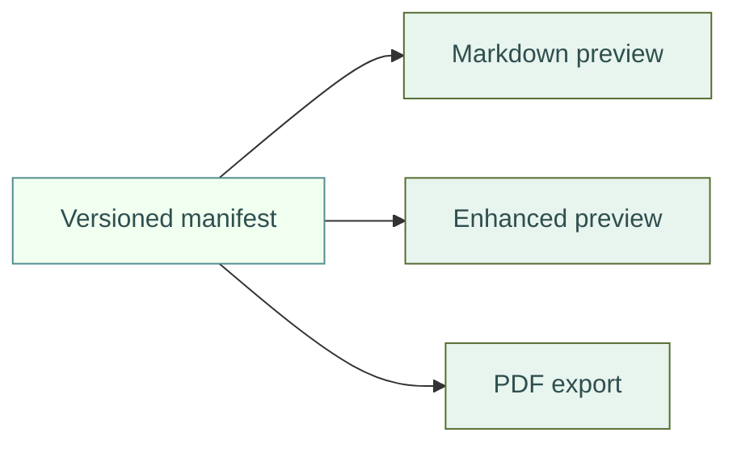

<p align="center">
  
</p>

# Documentation Renderer Test

Use this document to approve a FYTALA documentation-kit version in VS Code's built-in Markdown preview, Markdown Preview Enhanced, and Markdown PDF. It deliberately exercises the elements whose presentation is governed by the kit.

## Typography and links

Body text should use the configured type stack with dark-slate text. A [normal link](https://fytala.com) should remain visually distinct, and `inline code` should be readable without overpowering the paragraph.

> Blockquotes should have a restrained accent and remain readable in both preview and PDF output.

## Table

| Element | Expected result | Reference |
|---|---|---|
| Header | Dark slate with light mint text | `--table-header-bg` |
| Link in header | Inherits the header foreground | [Style guide](DOCUMENTATION_STYLE_GUIDE.md) |
| Alternating row | Subtle neutral contrast | Canonical stylesheet |

## Code

```csharp
public sealed record DocumentationKit(string Version, bool IsPortable);
```

## Mermaid diagram



<p class="fytala-figure-caption"><strong>Renderer coverage.</strong> One versioned contract drives all supported local renderers.</p>

## Acceptance checklist

- The logo renders without a decorative frame.
- Table headers use dark slate and light mint, including links and inline code.
- The Mermaid canvas is white while semantic node colors remain visible.
- Code blocks, blockquotes, links, and captions remain legible.
- PDF output preserves local images, page margins, and diagram boundaries.
