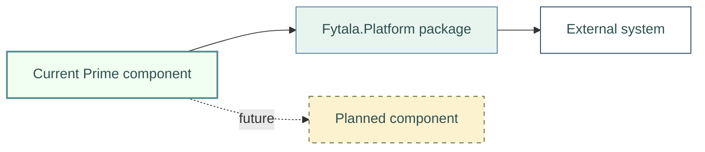

<div align="center">
  
  <br><br>
  <h1>Fytala Documentation Style Guide</h1>
  <p>Branding, diagrams, and accessible presentation for Prime documentation</p>
</div>

---

## Purpose

This guide is the source of truth for public-facing Markdown documentation in Prime. It keeps documents recognizably Fytala while preserving readable source text and compatibility with GitHub, IDE previews, generated HTML, and PDF output.

## Document Scope

The full branding contract applies to these canonical documents:

- `README.md`
- `docs/ARCHITECTURE.md`
- `docs/FEATURE_REQUESTS.md`
- `docs/INTEGRATION.md`
- `docs/MIGRATION.md`

Internal handover notes and package-level READMEs may use a compact heading without a branded banner. They should still use clear structure, accessible images, and the Fytala palette when they contain custom diagrams.

## About FYTALA

Every FYTALA project `README.md` should include the following company statement immediately after the standard header banner, separated by a horizontal rule. Keep the text verbatim unless the FYTALA mission statement changes.

```markdown
--- 
## About FYTALA

**FYTALA — Feeling Young, Thriving, Active, Learning Always** — is a personal initiative founded after retirement, driven by the belief that curiosity, enthusiasm, and learning have no age limit.

It is about staying engaged, exploring new ideas, and sharing the excitement of technology and innovation with others. A special ambition of FYTALA is to spark that enthusiasm in young people and encourage them to discover how fascinating technology can be—not just by talking about technology, but by making it visible, tangible, surprising, and fun.

My dream captures that ambition perfectly: **to walk into a classroom one day, side by side with a humanoid robot, and make my enthusiasm for technology and innovation contagious.**

If that experience inspires even a few young minds to start asking questions, experimenting, building, programming, or imagining what might be possible, FYTALA has achieved something worthwhile.

Technology, after all, is not just about machines, electronics, or software. It is about curiosity, creativity, and turning ideas into reality. FYTALA therefore takes a deliberately broad perspective, embracing software, electronics, engineering, science, artificial intelligence, robotics, and whatever comes next.

> Experimenting matters.
>
> Making mistakes matters.
>
> Understanding *why* something works matters even more.

Every project is an opportunity to learn something new and, hopefully, to help someone else learn as well.

The cable-stayed bridge in the FYTALA logo represents that philosophy. A bridge connects places, but it can also connect people, ideas, generations, and fields of knowledge. Its strength comes from many individual elements working together—much like technology itself.

FYTALA wants to help build those bridges: between experience and youthful curiosity, theory and practice, and imagination and real-world creation. It encourages looking beyond the obvious, asking questions, taking things apart, and building them again in new ways.

Above all, FYTALA is about keeping the desire to discover alive—and passing that desire on to the next generation.

> Because we never have to stop being curious.
>
> We never have to stop creating.
>
> And we are never too old—or too young—to learn something new.
```

## Standard Header

Use a centered logo, document title, and one-line purpose. Documents below the repository root use `../assets`; the root README uses `assets`.

```html
<div align="center">
  
  <br><br>
  <h1>[Document title]</h1>
  <p>[One-line purpose]</p>
</div>
```

Use the dark logo on light backgrounds and the light logo on dark backgrounds. Approved master logos live in [`assets/logos`](../assets/logos/README.md); avoid copying logos into document-specific folders.

## Brand Tokens

| Role | Color | Typical use |
|---|---|---|
| Primary text | `#2F4F4F`  | Labels and body text |
| Secondary text | `#556B2F`  | Titles and strong borders |
| Primary surface | `#F0FFF0`  | Current Prime components |
| Secondary surface | `#E8F4EE`  | Fytala.Platform components and groups |
| Structural accent | `#5178A8`  | Connectors and external boundaries |
| Teal accent | `#518D8F`  | Current-component borders |
| Success accent | `#98D481`  | Successful or completed states |
| Planned surface | `#FDF2CF`  | Proposed or future components |

The complete reusable tokens are in [`fytala-brand.css`](../assets/css/fytala-brand.css). Markdown/HTML and PDF renderers can additionally use [`fytala-markdown.css`](../assets/css/fytala-markdown.css) and the files under `assets/css`.

The [FYTALA Documentation Kit](../docs-kit/README.md) versions the canonical renderer contract. Repositories record the adopted version in `.fytala-docs.json`; `docs-kit/manifest.json` lists required assets, destinations, SHA-256 integrity values, and portable workspace settings. `DocumentationStyleChecker` reports contract drift as advisory warnings during rollout. Validate upgrades with the [renderer test](DOCUMENTATION_RENDERER_TEST.md) before enabling blocking enforcement.

Markdown table headers pair the logo's dark slate (`#2F4F4F`) with its light mint (`#E8F4EE`) for consistent, high-contrast labels. Links and inline code in a header inherit the same light foreground instead of reverting to renderer defaults.

## Mermaid Diagrams

Diagrams should explain a relationship, boundary, or sequence that would otherwise require substantial prose. Keep the accompanying text because diagrams are a visual aid rather than the sole architectural record.

Use these semantic styles consistently:



For controlled HTML or PDF rendering, [`mermaid-theme-config.js`](../assets/css/mermaid-theme-config.js) supplies the full shared theme. Embed essential `classDef` declarations in source diagrams because repository Markdown renderers do not automatically load project JavaScript or CSS.

### Diagram conventions

- Use solid arrows for active dependencies or calls and dashed arrows for planned or optional relationships.
- Label boundaries and non-obvious connectors.
- Distinguish current, platform, external, and planned elements by both color and border treatment.
- Keep node labels short; explain qualifications in adjacent prose.
- Give referenceable diagrams a stable semantic anchor, such as `<a id="architecture-provider-routing"></a>`.
- Add a concise caption immediately after each referenceable diagram using the `fytala-figure-caption` class.
- Use semantic names in indexes and links; avoid fragile sequential labels such as “Figure 1.”
- Prefer left-to-right flows for processes and bottom-to-top flows for dependency tiers.

The shared Markdown stylesheet gives Mermaid diagrams a clean white canvas, plus a thin teal border, an 8px corner radius, and a restrained shadow. The neutral canvas keeps the page quiet while semantic node and group fills carry the diagram's meaning. Opt-in `.fytala-figure` containers also retain their white surface. Captions remain in the Fytala type family but use italic text, structural blue, and a stronger upright label to distinguish them without relying on color alone. Do not frame logos, icons, token swatches, or other decorative images.

The repository uses the same canonical stylesheet through three renderer-specific integration points:

| Renderer | Configuration | Notes |
|---|---|---|
| VS Code built-in preview | `.vscode/settings.json` → `markdown.styles` | Reload an open preview after style changes. |
| Markdown Preview Enhanced | `.crossnote/style.less` and `.crossnote/config.js` | Imports the canonical CSS, repeats preview-critical overrides so imported-file changes invalidate its style cache, and supplies Mermaid theme variables directly to the renderer. |
| Markdown PDF | `.vscode/settings.json` → `markdown-pdf.styles` | Uses the extension's platform-specific browser resolution and download behavior. |

Machine-specific browser paths belong in VS Code user settings rather than the shared workspace configuration. GitHub preserves the anchors, index links, caption text, portable Mermaid classes, and local images but does not load repository CSS.

## Accessibility and Portability

- Every image must have meaningful `alt` text; do not use filenames as descriptions.
- Do not communicate status through color alone.
- Maintain readable contrast and avoid text smaller than the surrounding document.
- Use repository-relative asset paths and verify that referenced assets exist.
- Avoid layout-critical inline CSS because Markdown renderers support different HTML subsets.
- Keep headings and prose meaningful when HTML and Mermaid rendering are unavailable.

## Hygiene Enforcement

`DocumentationBrandingChecker` examines changed canonical documents and emits advisory warnings when an approved logo or meaningful Fytala alt text is missing. The rule intentionally starts as advisory so existing workflows remain stable while the branding contract matures.

Broken assets and inaccessible content may become blocking rules after the conventions have been adopted across FYTALA repositories and false positives have been addressed.

---

*Last updated: 2026-08-26*
